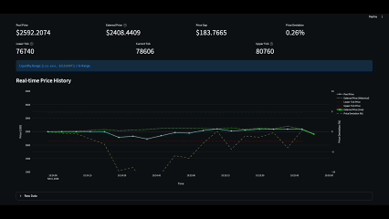
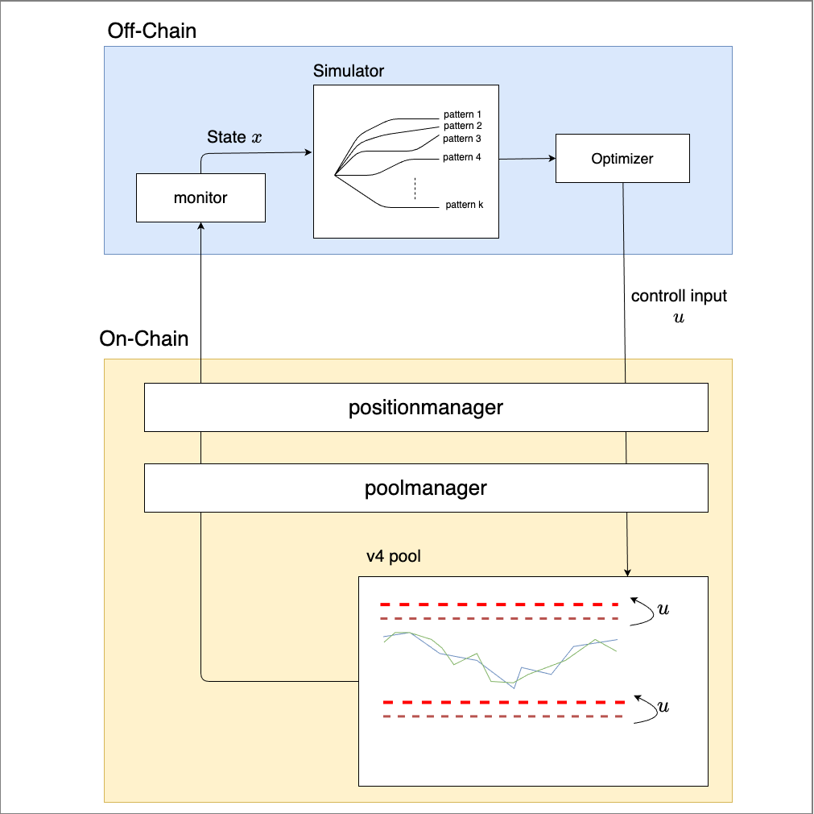

# v4-KineticFlow: Predictive Liquidity for Uniswap v4
<p align="center">
  
  <br>
  <i>MPPI-driven stochastic range optimization in action on Base Sepolia.</i>
</p>
**_From reflexes to foresight: a model-predictive LP agent on Base._**

`v4-KineticFlow` is an agentic liquidity vault for **Uniswap v4** that uses  
**Model Predictive Path Integral (MPPI)** control to _predict_ future prices and  
rebalance concentrated liquidity ranges **before** the market moves there.

Built on **Base Sepolia** with **Uniswap v4 Hooks** and a Python control engine,  
the system continuously:
- Simulates **$10^3+$** stochastic price paths.
- Scores each sequence with a **control-theoretic cost**.
- Executes the optimal range update on-chain via `PositionManager.modifyLiquidities`.

This is not just another “reactive” rebalance bot.  
It is a **stochastic optimal control policy** running **inside a DeFi protocol**.

---

## TL;DR

- **Problem**: Today’s LP strategies are mostly *reactive*. They chase price after it moves, leak fees when out-of-range, and ignore the distribution of future prices.
- **Idea**: Bring **stochastic optimal control** into Uniswap v4. Use **MPPI** to simulate thousands of possible future paths and place liquidity **where the price is most likely to be**, not where it is now.
- **Implementation**:
  - Uniswap v4 stack + Hook on **Base Sepolia**.
  - Python MPPI engine controlling **ticks**, not prices.
  - Arbitrage bot that anchors pool price to an external oracle.
  - Streamlit dashboard for real-time PnL & gas metrics.
- **Outcome**: A research-grade LP agent demonstrating the feasibility of predictive control on a live L2.

---

## The Problem: Reactive Concentrated Liquidity

Uniswap v3/v4 gave LPs **concentrated liquidity**, but left them with a hard problem:
- **Impermanent Loss (IL)** grows when LPs are stuck out-of-range.
- **Capital efficiency** collapses if ranges are too wide “just to be safe”.
- **Most bots are reactive**: They behave like *PID controllers* in a world that actually needs **predictive control**.

For an LP vault to be truly competitive, it must optimize **fee income − gas cost − IL** over a horizon, anticipating where price *will be*.

---

## The Solution: An MPPI Engine on Uniswap v4

### MPPI Theory in One Paragraph
MPPI (Model Predictive Path Integral control) is a sampling-based stochastic optimal control method. Instead of solving the Hamilton–Jacobi–Bellman PDE exactly, MPPI:
1. Samples many control sequences $\{u_{0:T}^k\}_{k=1}^K$.
2. Simulates trajectories $x_{0:T}^k$ with dynamics $x_{t+1} = f(x_t, u_t^k, \xi_t^k)$.
3. Computes path costs:
   $$S^k = \sum_{t=0}^{T-1} \ell(x_t^k, u_t^k) + \phi(x_T^k)$$
4. Reweights controls using an exponential weighting:
   $$u_t^\star = \frac{\sum_k \exp(-S^k / \lambda)\, u_t^k}{\sum_k \exp(-S^k / \lambda)}$$
5. Applies only the **first element** $u_0^\star$ on-chain, then repeats (receding horizon).

### Control State: Working in Tick Space
We formulate the MPPI problem directly in **ticks**, the discrete unit of Uniswap v4:
- **State** $x_t \in \mathbb{R}^4$:
  $$x_t = [t_\text{mkt}(t),\ t_\text{pool}(t),\ t_\text{center}(t),\ w_\text{ticks}(t)]$$
- **Control** $u_t \in \mathbb{R}^2$:
  $$u_t = [\Delta t_\text{center},\ \Delta w_\text{ticks}]$$

The corresponding **target Uniswap v4 range** is:
$$t_\text{lower} = t_\text{center}^{\text{new}} - w_\text{ticks}^{\text{new}},\quad t_\text{upper} = t_\text{center}^{\text{new}} + w_\text{ticks}^{\text{new}}$$

### Orbit Cost (Trajectory Cost) and Dynamics

The **path cost** $S^k$ in MPPI is the sum of **stage costs** over the horizon, a **terminal cost**, and a **control penalty**. The implementation in `dashboard/optimizer/` uses the following.

**Dynamics** (`utils.py`):

- **State** $x_t = [t_\text{mkt},\, t_\text{pool},\, t_\text{center},\, w_\text{ticks}]$ evolves as:
  - **Market tick**: $t_\text{mkt}(t+1) = t_\text{mkt}(t) + \Delta t_\text{mkt}$ with $\Delta t_\text{mkt} = \log(\text{price factor}) / \log(1.0001)$. Price factors are sampled from a **jump–diffusion** model: GBM with $\sigma=0.02$, $\mu=0$, plus jumps (probability $0.05$, size $\exp(0.1 \cdot z)$), then clamped to $[0.7,\, 1.3]$ to avoid extreme outliers.
  - **Range**: $t_\text{center}(t+1) = t_\text{center}(t) + \Delta t_\text{center}$, $w_\text{ticks}(t+1) = \max(w_\text{ticks}(t) + \Delta w_\text{ticks},\, 120)$ (width lower bound aligned with `tickSpacing=60`).
  - **Pool tick**: Follows market within the range; outside the range it is clamped to the range bounds. Tracking speed uses a deviation-dependent gain $k = 0.2 + 0.75\tanh(2 \cdot \text{rel\_dev})$ so the pool price moves faster when it is far from the market.

**Stage cost** $\ell(x_t,\, u_t)$ (`cost_function.py`), per step:

| Term | Formula / condition | Role |
|------|----------------------|------|
| Fee reward | $-0.01$ if pool tick is in range, else $0$ | Encourages in-range liquidity. |
| IL / tracking | $5 \times 10^{-5} \cdot (t_\text{mkt} - t_\text{pool})^2$ | Penalizes pool–market tick divergence (proxy for IL). |
| Boundary hit | $0.05$ if pool tick is within 1 tick of lower/upper edge | Discourages being pinned at range edges. |
| Proximity | $2 \times 10^{-5} \cdot \text{proximity}^2$, with $\text{proximity} = \max(0,\, 120 - \text{dist\_to\_edge})$ (tick) | Prefers keeping the pool tick at least ~120 ticks away from range edges (buffer). |
| Market outside | $5 \times 10^{-4} \cdot d^2$ if market tick is outside range, $d$ = distance to nearest bound | Strong penalty when the market has left the current range. |
| Rebalance (gas proxy) | $0.002$ if $\|\Delta t_\text{center}\| + \|\Delta w_\text{ticks}\| > 120$ ticks | Approximates gas cost for non-trivial rebalances. |

**Terminal cost** $\phi(x_T)$:

- **Distance**: $5 \times 10^{-5} \cdot (t_\text{mkt} - t_\text{center})^2$ — penalizes end-of-horizon misalignment of market and range center.
- **Width**: $1 \times 10^{-4} \cdot w_\text{ticks}$ — penalizes wide ranges (lower capital efficiency).

**Total path cost** (controller): $S^k = \sum_{t=0}^{T-1} \ell(x_t^k,\, u_t^k) + \phi(x_T^k) + \lambda \sum_{t=0}^{T-1} \text{action\_cost}(u_t^k)$. Control inputs are weighted by the same $\lambda$ and noise covariance used in the MPPI update. All cost weights and the dynamics parameters above are defined in `dashboard/optimizer/utils.py` and `dashboard/optimizer/cost_function.py`.

---

## System Architecture

The system bridges off-chain predictive compute with on-chain execution via Uniswap v4 Hooks on Base Sepolia.

<p align="center">
  
</p>

## Roadmap

### Short-Term (Hackathon-Ready)

- **Metrics dashboard**:
  - add PnL & gas plots in `app.py` using `tx_events`
  - support comparisons between:
    - MPPI controller,
    - fixed-range LP,
    - naive periodic recentering.

- **Parameter sweeps**:
  - horizon length, number of samples, noise scales
  - cost weights vs realized fee income and gas

- **Safer production defaults**:
  - stricter min/max liquidity,
  - refined price-impact caps for arb swaps.


### Long-Term Vision

The long-term goal is to build a **general-purpose control layer for DeFi**, where:

- LP vaults, liquidators, and routers are all modeled as **interacting control systems**, and
- DeFi can borrow the last 50 years of **control theory, PDEs, and stochastic calculus**  
  instead of reinventing ad-hoc heuristics every cycle.

`v4-KineticFlow` is a first step: a concrete, running MPPI agent on Uniswap v4.

---

## Setup & Usage

### Requirements

- **Foundry** (`forge`) for deploying the v4 stack and hooks.
- **Python 3.10+** with:
  - `torch`, `numpy`, `pandas`, `web3`, `streamlit`, etc. (see `requirements.txt`).
- **Docker** (optional) for running the dashboard as a container.

### Environment

1. Copy `.env.example` to `.env` and fill in:
   - `BASE_SEPOLIA_RPC_URL`
   - `PRIVATE_KEY`, `ARB_PRIVATE_KEY`, `MPPI_PRIVATE_KEY`
2. Ensure `.env` is **never committed**.

### Typical Workflow (Base Sepolia)

1. Deploy:

```bash
make deploy-base-sepolia
```

2. Fund:

- send Base Sepolia ETH to deployer, arb, and MPPI wallets,
- ensure MPPI wallet holds token0/token1 (script does this for mock tokens).

3. Run the stack:

```bash
make build
make run
make logs
```

4. Open the dashboard:

- `http://localhost:8501` in your browser.

5. Inspect:

- price vs oracle,
- LP range over time,
- `📊 Arb PnL` / `📊 MPPI PnL` lines in logs,
- Tx hashes on Base Sepolia explorer for rebalance and swap events.

---

## Team / Author

This project is built by a **Kyoto University** student specializing in:

- **control engineering** (modeling, stochastic systems),
- **machine learning**, and
- **DeFi protocol design**.

The goal is to bring **serious control theory** into onchain finance —  
to move DeFi from _“if price > X then do Y”_ scripts to  
**principled, predictive agents**.

Along the way, a mis-committed `.env.example` and a **swiftly drained \$10 testnet wallet**  
served as a very real reminder that:

- the adversary is automated,
- mistakes are punished instantly, and
- resilient systems require both **good math** and **good operational hygiene**.

If you are a **VC, protocol, or research lab** exploring:

- agentic LP vaults,
- predictive execution on Uniswap v4,
- or DeFi × control/PDE,

`v4-KineticFlow` is intended as a serious starting point — and a live demo —  
for what that future could look like.